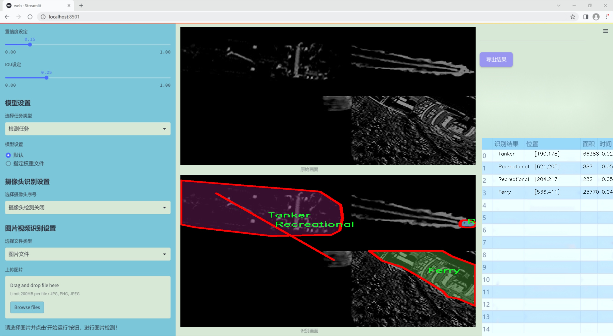
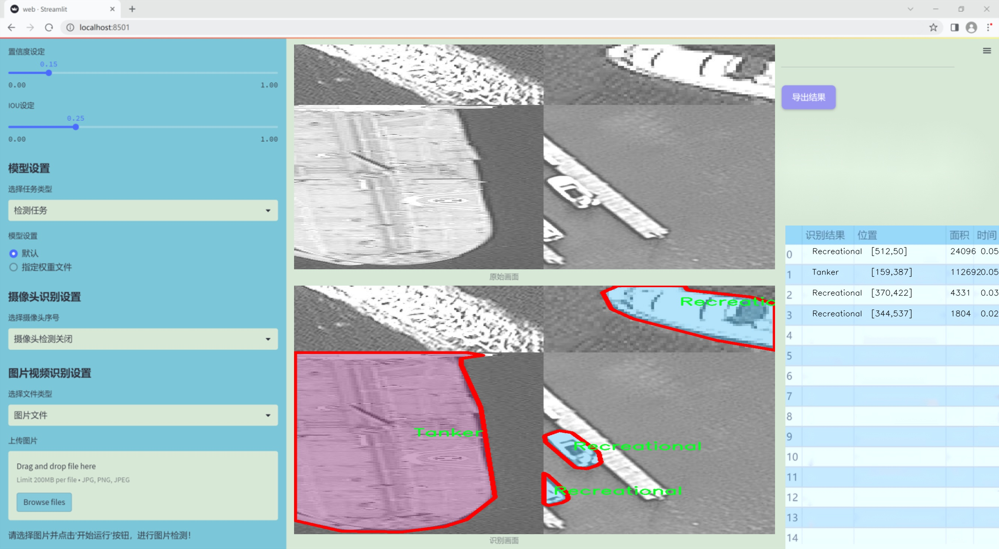
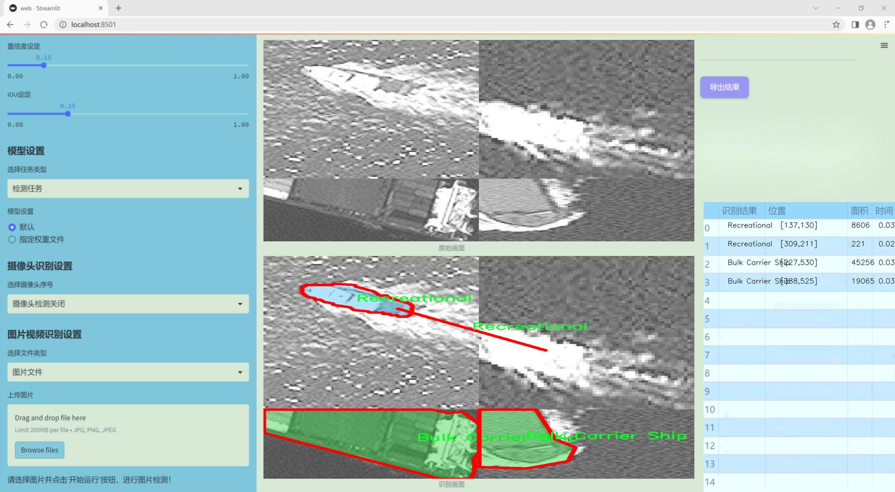
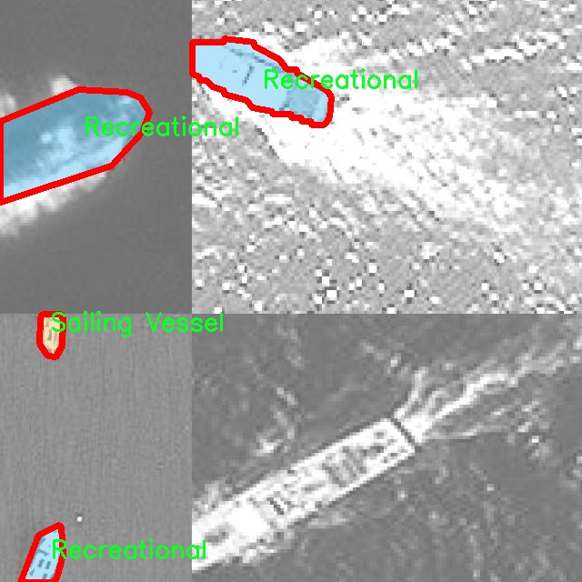
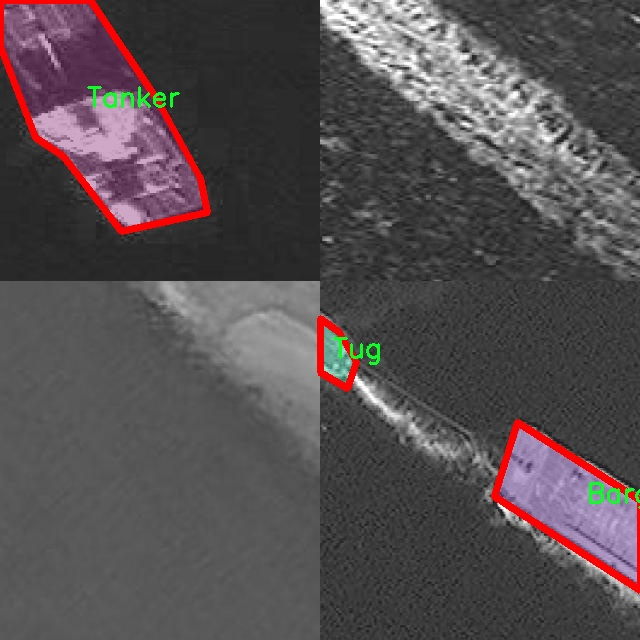
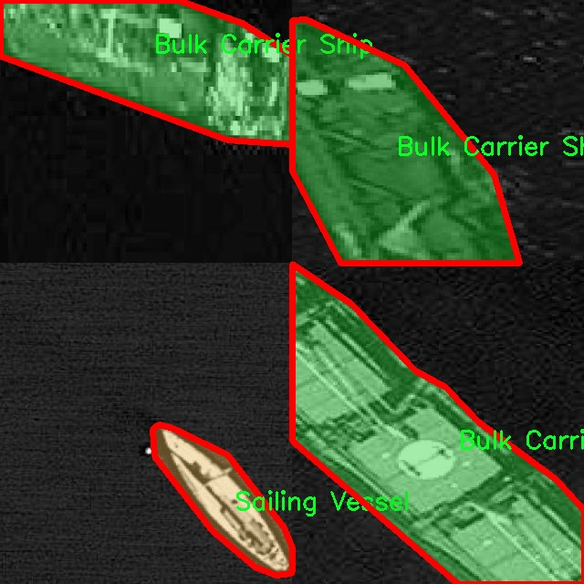
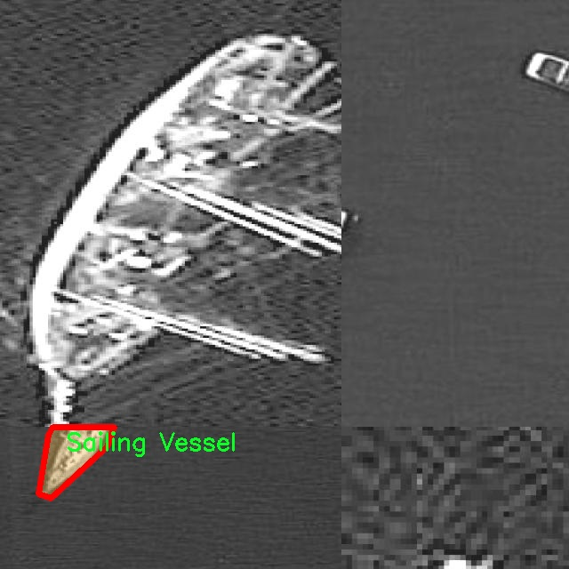
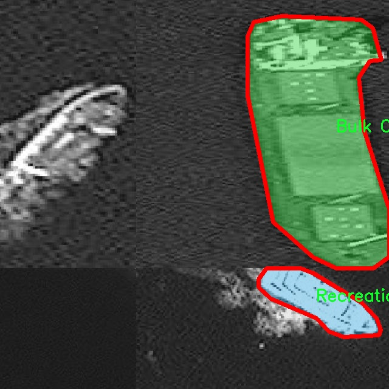

# 改进yolo11-SEAMHead等200+全套创新点大全：船舶类型检测图像分割系统源码＆数据集全套

### 1.图片效果展示







##### 项目来源 **[人工智能促进会 2024.11.01](https://kdocs.cn/l/cszuIiCKVNis)**

注意：由于项目一直在更新迭代，上面“1.图片效果展示”和“2.视频效果展示”展示的系统图片或者视频可能为老版本，新版本在老版本的基础上升级如下：（实际效果以升级的新版本为准）

  （1）适配了YOLOV11的“目标检测”模型和“实例分割”模型，通过加载相应的权重（.pt）文件即可自适应加载模型。

  （2）支持“图片识别”、“视频识别”、“摄像头实时识别”三种识别模式。

  （3）支持“图片识别”、“视频识别”、“摄像头实时识别”三种识别结果保存导出，解决手动导出（容易卡顿出现爆内存）存在的问题，识别完自动保存结果并导出到tempDir中。

  （4）支持Web前端系统中的标题、背景图等自定义修改。

  另外本项目提供训练的数据集和训练教程,暂不提供权重文件（best.pt）,需要您按照教程进行训练后实现图片演示和Web前端界面演示的效果。

### 2.视频效果展示

[2.1 视频效果展示](https://www.bilibili.com/video/BV1xaSdYAEsy/)

### 3.背景

研究背景与意义

随着全球航运业的迅速发展，船舶类型的多样化和数量的增加使得海洋交通管理和安全监控面临着前所未有的挑战。传统的船舶识别方法往往依赖于人工监测，效率低下且容易受到人为因素的影响。因此，基于计算机视觉的自动化船舶类型检测技术逐渐成为研究的热点。YOLO（You Only Look Once）系列模型因其高效的实时目标检测能力而被广泛应用于各类图像处理任务中，尤其是在复杂环境下的物体识别方面表现出色。近年来，YOLOv11的改进版本在检测精度和速度上都有了显著提升，为船舶类型检测提供了新的技术支持。

本研究旨在基于改进的YOLOv11模型，构建一个高效的船舶类型检测图像分割系统。该系统将利用NRL Ships数据集，该数据集包含3200幅图像，涵盖了包括驳船、散货船、集装箱船、游艇等在内的多种船舶类型，具有丰富的类别信息和多样的场景设置。这为模型的训练和测试提供了良好的基础，能够有效提升模型在实际应用中的泛化能力。

通过对船舶类型的准确识别和分割，本研究不仅可以为海洋交通管理提供重要的数据支持，还能够在海洋环境保护、海上安全监控等领域发挥积极作用。随着技术的不断进步，基于深度学习的船舶检测系统将有望实现更高的自动化水平，推动智能航运的发展。因此，本研究的开展具有重要的理论意义和实际应用价值，为未来的海洋智能监控系统奠定基础。

### 4.数据集信息展示

##### 4.1 本项目数据集详细数据（类别数＆类别名）

nc: 16
names: ['Barge', 'Bulk Carrier Ship', 'Commercial', 'Container Ships', 'Cruise Shp', 'Ferry', 'Fishing', 'Military Vessel', 'Other Vessel', 'ROLO Vessel', 'Recreational', 'Sailing Vessel', 'Small Support Vessel', 'Small Working Vessel', 'Tanker', 'Tug']


该项目为【图像分割】数据集，请在【训练教程和Web端加载模型教程（第三步）】这一步的时候按照【图像分割】部分的教程来训练

##### 4.2 本项目数据集信息介绍

本项目数据集信息介绍

本项目所使用的数据集名为“NRL Ships”，该数据集专为船舶类型检测和图像分割任务而设计，旨在提升YOLOv11模型在船舶识别领域的性能。数据集中包含16个不同的船舶类别，涵盖了广泛的船舶类型，以确保模型能够在多样化的海洋环境中进行准确的分类和分割。这16个类别包括：驳船（Barge）、散货船（Bulk Carrier Ship）、商业船舶（Commercial）、集装箱船（Container Ships）、游轮（Cruise Ship）、渡轮（Ferry）、渔船（Fishing）、军舰（Military Vessel）、其他船舶（Other Vessel）、ROLO船舶（ROLO Vessel）、休闲船（Recreational）、帆船（Sailing Vessel）、小型支援船（Small Support Vessel）、小型工作船（Small Working Vessel）、油轮（Tanker）以及拖船（Tug）。

“NRL Ships”数据集的多样性和丰富性为模型的训练提供了坚实的基础，确保其在面对不同类型船舶时，能够进行有效的识别和处理。每个类别的图像都经过精心标注，确保数据的准确性和可靠性，这对于提高模型的泛化能力至关重要。此外，数据集中包含的图像在不同的光照、天气和海洋条件下拍摄，进一步增强了模型在实际应用中的适应性。

通过利用“NRL Ships”数据集，我们的目标是改进YOLOv11的船舶类型检测和图像分割系统，使其能够在复杂的海洋环境中实现高效、准确的船舶识别。这不仅将推动船舶监测技术的发展，还将为海洋安全和资源管理提供有力支持。











### 5.全套项目环境部署视频教程（零基础手把手教学）

[5.1 所需软件PyCharm和Anaconda安装教程（第一步）](https://www.bilibili.com/video/BV1BoC1YCEKi/?spm_id_from=333.999.0.0&vd_source=bc9aec86d164b67a7004b996143742dc)


[5.2 安装Python虚拟环境创建和依赖库安装视频教程（第二步）](https://www.bilibili.com/video/BV1ZoC1YCEBw?spm_id_from=333.788.videopod.sections&vd_source=bc9aec86d164b67a7004b996143742dc)

### 6.改进YOLOv11训练教程和Web_UI前端加载模型教程（零基础手把手教学）

[6.1 改进YOLOv11训练教程和Web_UI前端加载模型教程（第三步）](https://www.bilibili.com/video/BV1BoC1YCEhR?spm_id_from=333.788.videopod.sections&vd_source=bc9aec86d164b67a7004b996143742dc)


按照上面的训练视频教程链接加载项目提供的数据集，运行train.py即可开始训练



     Epoch   gpu_mem       box       obj       cls    labels  img_size
     1/200     20.8G   0.01576   0.01955  0.007536        22      1280: 100%|██████████| 849/849 [14:42<00:00,  1.04s/it]
               Class     Images     Labels          P          R     mAP@.5 mAP@.5:.95: 100%|██████████| 213/213 [01:14<00:00,  2.87it/s]
                 all       3395      17314      0.994      0.957      0.0957      0.0843

     Epoch   gpu_mem       box       obj       cls    labels  img_size
     2/200     20.8G   0.01578   0.01923  0.007006        22      1280: 100%|██████████| 849/849 [14:44<00:00,  1.04s/it]
               Class     Images     Labels          P          R     mAP@.5 mAP@.5:.95: 100%|██████████| 213/213 [01:12<00:00,  2.95it/s]
                 all       3395      17314      0.996      0.956      0.0957      0.0845

     Epoch   gpu_mem       box       obj       cls    labels  img_size
     3/200     20.8G   0.01561    0.0191  0.006895        27      1280: 100%|██████████| 849/849 [10:56<00:00,  1.29it/s]
               Class     Images     Labels          P          R     mAP@.5 mAP@.5:.95: 100%|███████   | 187/213 [00:52<00:00,  4.04it/s]
                 all       3395      17314      0.996      0.957      0.0957      0.0845


###### [项目数据集下载链接](https://kdocs.cn/l/cszuIiCKVNis)

### 7.原始YOLOv11算法讲解


其实到了YOLOV11 基本创新点就不太多了，主要就是大家互相排列组合复用不同的网络模块、损失函数和样本匹配策略，需要注意YOLO V5、V8 V11
都是1个公司的，其余的个人建议看看V8的，剩下的了解就好。

V11支持多种视觉任务：物体检测、实例分割、图像分类、姿态估计和定向物体检测（OBB）。

##### YOLOv11
基本和YOLOV8同源，甚至git目前都是1个，部分代码注释还是YOLOV8的，所以建议先看我写的YOLOV8相关博客，对比YOLOV8主要涉及到：

*backbone 中的使用C2f模块 变为 c3k2 模块。

*backbone 中的最后一层（sppf层）后增加了C2PSA模块。

*head 解耦头中的分类检测头两个Conv 变为 DWConv。

整体技术而言：

*backbone 使用了C2K2模块+最后SPPF模块级联C2PSA模块；

*neck 使用PAN结构，并且里面也使用C3K2模块；

*head使用了anchor-free + Decoupled-head，其中回归头使用正常的卷积，分类头使用DWConv；

*损失函数使用了分类BCE、回归CIOU + VFL的组合；

*框匹配策略由静态匹配改为了Task-Aligned Assigner匹配方式；

*训练策略没有提及，其中YOLOV8可以参考如下最后 10 个 epoch 关闭 Mosaic 的操作、训练总 epoch 数从 300 提升到了 500。

##### 主要思路


配置文件：[ultralytics/ultralytics/cfg/models/11/yolo11.yaml at main ·
ultralytics/ultralytics ·
GitHub](https://github.com/ultralytics/ultralytics/blob/main/ultralytics/cfg/models/11/yolo11.yaml
"ultralytics/ultralytics/cfg/models/11/yolo11.yaml at main ·
ultralytics/ultralytics · GitHub")

解析函数：[ultralytics/ultralytics/nn/tasks.py at main · ultralytics/ultralytics ·
GitHub](https://github.com/ultralytics/ultralytics/blob/main/ultralytics/nn/tasks.py#L934
"ultralytics/ultralytics/nn/tasks.py at main · ultralytics/ultralytics ·
GitHub")


##### 具体细节

##### input

输入要求以及预处理，可选项比较多，可以参考这个配置文件：[ultralytics/ultralytics/cfg/default.yaml at main
· ultralytics/ultralytics ·
GitHub](https://github.com/ultralytics/ultralytics/blob/main/ultralytics/cfg/default.yaml
"ultralytics/ultralytics/cfg/default.yaml at main · ultralytics/ultralytics ·
GitHub") 的Hyperparameters 部分。

基础输入仍然为640*640。预处理就是熟悉的letterbox（根据参数配置可以为不同的缩放填充模式，主要用于resize到640）+
转换rgb、chw、int8(0-255)->float（0-1），注意没有归一化操作。需要注意的是作者实现的mosaic和网上看到的不同，对比如下图（左边网上版本，右边是YOLO的实现）。并且作者添加了在最后10轮关闭mosaic增强（YOLOV8开始支持，具体原因个人的经验如我的这篇文章：yolov5
mosaic相关，关闭参数在 Train settings 部分的close_mosaic 选项）


##### backbone

主干网络以及改进

这里不去特意强调对比YOLOv5、V8等等的改进，因为各个系列都在疯狂演进，个人认为没必要花费时间看差异，着重看看一些比较重要的模块即可。源代码：

大多数模块：[ultralytics/ultralytics/nn/modules/block.py at main ·
ultralytics/ultralytics ·
GitHub](https://github.com/ultralytics/ultralytics/blob/main/ultralytics/nn/modules/block.py
"ultralytics/ultralytics/nn/modules/block.py at main · ultralytics/ultralytics
· GitHub")

head 部分：[ultralytics/ultralytics/nn/modules/head.py at main ·
ultralytics/ultralytics ·
GitHub](https://github.com/ultralytics/ultralytics/blob/main/ultralytics/nn/modules/head.py
"ultralytics/ultralytics/nn/modules/head.py at main · ultralytics/ultralytics
· GitHub")

串联模块构造网络：[ultralytics/ultralytics/nn/tasks.py at main ·
ultralytics/ultralytics ·
GitHub](https://github.com/ultralytics/ultralytics/blob/main/ultralytics/nn/tasks.py
"ultralytics/ultralytics/nn/tasks.py at main · ultralytics/ultralytics ·
GitHub")

##### 1）CBS 模块（后面叫做Conv）

就是pytorch 自带的conv + BN +SiLU，这里对应上面的配置文件的Conv 的 args 比如[64, 3, 2] 就是 conv2d
的c2=64、k=3、 s =2、c1 自动为上一层参数、p 为自动计算，真实需要计算scales 里面的with 和 max_channels 缩放系数。

这里连续使用两个3*3卷积stride为2的CBS模块直接横竖各降低了4倍分辨率（整体变为原来1/16）。这个还是比较猛的，敢在如此小的感受野下连续两次仅仅用一层卷积就下采样,当然作为代价它的特征图还是比较厚的分别为16、32。


    
    
        class Conv(nn.Module):
        """Standard convolution with args(ch_in, ch_out, kernel, stride, padding, groups, dilation, activation)."""
    
        default_act = nn.SiLU()  # default activation
    
        def __init__(self, c1, c2, k=1, s=1, p=None, g=1, d=1, act=True):
            """Initialize Conv layer with given arguments including activation."""
            super().__init__()
            self.conv = nn.Conv2d(c1, c2, k, s, autopad(k, p, d), groups=g, dilation=d, bias=False)
            self.bn = nn.BatchNorm2d(c2)
            self.act = self.default_act if act is True else act if isinstance(act, nn.Module) else nn.Identity()
    
        def forward(self, x):
            """Apply convolution, batch normalization and activation to input tensor."""
            return self.act(self.bn(self.conv(x)))
    
        def forward_fuse(self, x):
            """Perform transposed convolution of 2D data."""
            return self.act(self.conv(x))

##### 2）c3k2 模块

##### Bottleneck

有两种结构，需要参数shortcut和两个conv的宽度是否相同来控制。

##### C3 & C3K

都是CSP bottleneck module with 3 convolutions, C3 代表3个卷积层，
K代表其中bottleneck中的卷积核为支持自定义，其实这里c3k作者使用的默认的3*3卷积核也就等同于使用c3(c3是3*3卷积核)。

##### c2f & c3k2

其实也就是仿照YOLOv7 的ELAN
结构，通过更多的分支夸层链接，丰富了模型的梯度流。C3K2模块其实就是C2F模块转变出来的，它代码中有一个设置，就是当c3k这个参数为FALSE的时候，C3K2模块就是C2F模块，也就是说它的Bottleneck是普通的Bottleneck；反之当它为true的时候，将Bottleneck模块替换成C3K模块。模块中存在
Split 等操作对特定硬件部署没有之前那么友好了。需要针对自己的硬件进行测试看对最终推理速度的影响。

可视化关系如下，这里需要注意配置文件中的参数，比如21行[-1, 2, C3k2, [512, False, 0.25]]
512代表宽度、false代表是否使用shortcut、0.25代表c2f的宽度缩放。也就是第一个Conv的输出宽度。


源代码如下:

    
    
    class Bottleneck(nn.Module):
        """Standard bottleneck."""
    
        def __init__(self, c1, c2, shortcut=True, g=1, k=(3, 3), e=0.5):
            """Initializes a standard bottleneck module with optional shortcut connection and configurable parameters."""
            super().__init__()
            c_ = int(c2 * e)  # hidden channels
            self.cv1 = Conv(c1, c_, k[0], 1)
            self.cv2 = Conv(c_, c2, k[1], 1, g=g)
            self.add = shortcut and c1 == c2
    
        def forward(self, x):
            """Applies the YOLO FPN to input data."""
            return x + self.cv2(self.cv1(x)) if self.add else self.cv2(self.cv1(x))
    
    class C3(nn.Module):
        """CSP Bottleneck with 3 convolutions."""
    
        def __init__(self, c1, c2, n=1, shortcut=True, g=1, e=0.5):
            """Initialize the CSP Bottleneck with given channels, number, shortcut, groups, and expansion values."""
            super().__init__()
            c_ = int(c2 * e)  # hidden channels
            self.cv1 = Conv(c1, c_, 1, 1)
            self.cv2 = Conv(c1, c_, 1, 1)
            self.cv3 = Conv(2 * c_, c2, 1)  # optional act=FReLU(c2)
            self.m = nn.Sequential(*(Bottleneck(c_, c_, shortcut, g, k=((1, 1), (3, 3)), e=1.0) for _ in range(n)))
    
        def forward(self, x):
            """Forward pass through the CSP bottleneck with 2 convolutions."""
            return self.cv3(torch.cat((self.m(self.cv1(x)), self.cv2(x)), 1))
    
    class C3k(C3):
        """C3k is a CSP bottleneck module with customizable kernel sizes for feature extraction in neural networks."""
    
        def __init__(self, c1, c2, n=1, shortcut=True, g=1, e=0.5, k=3):
            """Initializes the C3k module with specified channels, number of layers, and configurations."""
            super().__init__(c1, c2, n, shortcut, g, e)
            c_ = int(c2 * e)  # hidden channels
            # self.m = nn.Sequential(*(RepBottleneck(c_, c_, shortcut, g, k=(k, k), e=1.0) for _ in range(n)))
            self.m = nn.Sequential(*(Bottleneck(c_, c_, shortcut, g, k=(k, k), e=1.0) for _ in range(n)))
    
    class C2f(nn.Module):
        """Faster Implementation of CSP Bottleneck with 2 convolutions."""
    
        def __init__(self, c1, c2, n=1, shortcut=False, g=1, e=0.5):
            """Initializes a CSP bottleneck with 2 convolutions and n Bottleneck blocks for faster processing."""
            super().__init__()
            self.c = int(c2 * e)  # hidden channels
            self.cv1 = Conv(c1, 2 * self.c, 1, 1)
            self.cv2 = Conv((2 + n) * self.c, c2, 1)  # optional act=FReLU(c2)
            self.m = nn.ModuleList(Bottleneck(self.c, self.c, shortcut, g, k=((3, 3), (3, 3)), e=1.0) for _ in range(n))
    
        def forward(self, x):
            """Forward pass through C2f layer."""
            y = list(self.cv1(x).chunk(2, 1))
            y.extend(m(y[-1]) for m in self.m)
            return self.cv2(torch.cat(y, 1))
    
        def forward_split(self, x):
            """Forward pass using split() instead of chunk()."""
            y = list(self.cv1(x).split((self.c, self.c), 1))
            y.extend(m(y[-1]) for m in self.m)
            return self.cv2(torch.cat(y, 1))
    
    class C3k2(C2f):
        """Faster Implementation of CSP Bottleneck with 2 convolutions."""
    
        def __init__(self, c1, c2, n=1, c3k=False, e=0.5, g=1, shortcut=True):
            """Initializes the C3k2 module, a faster CSP Bottleneck with 2 convolutions and optional C3k blocks."""
            super().__init__(c1, c2, n, shortcut, g, e)
            self.m = nn.ModuleList(
                C3k(self.c, self.c, 2, shortcut, g) if c3k else Bottleneck(self.c, self.c, shortcut, g) for _ in range(n)
            )

##### 3）sppf 模块

对比spp，将简单的并行max pooling 改为串行+并行的方式。对比如下（左边是SPP，右边是SPPF）：


    
    
        class SPPF(nn.Module):
        # Spatial Pyramid Pooling - Fast (SPPF) layer for YOLOv5 by Glenn Jocher
        def __init__(self, c1, c2, k=5):  # equivalent to SPP(k=(5, 9, 13))
            super().__init__()
            c_ = c1 // 2  # hidden channels
            self.cv1 = Conv(c1, c_, 1, 1)
            self.cv2 = Conv(c_ * 4, c2, 1, 1)
            self.m = nn.MaxPool2d(kernel_size=k, stride=1, padding=k // 2)
    
        def forward(self, x):
            x = self.cv1(x)
            with warnings.catch_warnings():
                warnings.simplefilter('ignore')  # suppress torch 1.9.0 max_pool2d() warning
                y1 = self.m(x)
                y2 = self.m(y1)
                return self.cv2(torch.cat((x, y1, y2, self.m(y2)), 1))

##### 4）C2PSA 模块

C2PSA它结合了PSA(Pointwise Spatial
Attention)块，用于增强特征提取和注意力机制。下面的图建议从左到右看，这样才能更有条理的理解，其实PSA个人感觉就是仿着VIT
的Attention来做的，是把输入C2PSA的特征图的h*w 看做VIT 的path数（也可以理解为NLP中token 个数），特征图的channel
数看做VIT特征维度（CNN的宽度，或者理解为NLP中token
编码后的特征维度），然后计算出QKV（这里需要注意第四幅图的QKV是值，不是操作，所以标注成了圆角矩形，这里是为了大家好理解），这里的Attention其实是在h*w维度计算空间Attention，个人感觉是强制给了全局感受野，并且并联了一个3*3的深度可分离卷积的单空间部分，就是仅在每一个特征图上进行3*3卷积，具体实现是通过pytorch
conv2d 的
group参数设置为特征图的通道数。特别的关于Conv的参数分别为：输入通道数、输出通道数、卷积核尺寸、pad尺寸、group数、是否有激活函数（默认silu）。图中的最后一幅省略了一些细节，可以参考源码。

注意区别C2fPSA，C2fPSA才是对 C2f 模块的扩展，通过在标准 C2f 模块中引入 PSA
块，C2fPSA实现了更强大的注意力机制，从而提高了模型对重要特征的捕捉能力。作者实现了该模块但最终没有使用。


涉及的源码：

    
    
    class Attention(nn.Module):
        """
        Attention module that performs self-attention on the input tensor.
    
        Args:
            dim (int): The input tensor dimension.
            num_heads (int): The number of attention heads.
            attn_ratio (float): The ratio of the attention key dimension to the head dimension.
    
        Attributes:
            num_heads (int): The number of attention heads.
            head_dim (int): The dimension of each attention head.
            key_dim (int): The dimension of the attention key.
            scale (float): The scaling factor for the attention scores.
            qkv (Conv): Convolutional layer for computing the query, key, and value.
            proj (Conv): Convolutional layer for projecting the attended values.
            pe (Conv): Convolutional layer for positional encoding.
        """
    
        def __init__(self, dim, num_heads=8, attn_ratio=0.5):
            """Initializes multi-head attention module with query, key, and value convolutions and positional encoding."""
            super().__init__()
            self.num_heads = num_heads
            self.head_dim = dim // num_heads
            self.key_dim = int(self.head_dim * attn_ratio)
            self.scale = self.key_dim**-0.5
            nh_kd = self.key_dim * num_heads
            h = dim + nh_kd * 2
            self.qkv = Conv(dim, h, 1, act=False)
            self.proj = Conv(dim, dim, 1, act=False)
            self.pe = Conv(dim, dim, 3, 1, g=dim, act=False)
    
        def forward(self, x):
            """
            Forward pass of the Attention module.
    
            Args:
                x (torch.Tensor): The input tensor.
    
            Returns:
                (torch.Tensor): The output tensor after self-attention.
            """
            B, C, H, W = x.shape
            N = H * W
            qkv = self.qkv(x)
            q, k, v = qkv.view(B, self.num_heads, self.key_dim * 2 + self.head_dim, N).split(
                [self.key_dim, self.key_dim, self.head_dim], dim=2
            )
    
            attn = (q.transpose(-2, -1) @ k) * self.scale
            attn = attn.softmax(dim=-1)
            x = (v @ attn.transpose(-2, -1)).view(B, C, H, W) + self.pe(v.reshape(B, C, H, W))
            x = self.proj(x)
            return x
    
    class PSABlock(nn.Module):
        """
        PSABlock class implementing a Position-Sensitive Attention block for neural networks.
    
        This class encapsulates the functionality for applying multi-head attention and feed-forward neural network layers
        with optional shortcut connections.
    
        Attributes:
            attn (Attention): Multi-head attention module.
            ffn (nn.Sequential): Feed-forward neural network module.
            add (bool): Flag indicating whether to add shortcut connections.
    
        Methods:
            forward: Performs a forward pass through the PSABlock, applying attention and feed-forward layers.
    
        Examples:
            Create a PSABlock and perform a forward pass
            >>> psablock = PSABlock(c=128, attn_ratio=0.5, num_heads=4, shortcut=True)
            >>> input_tensor = torch.randn(1, 128, 32, 32)
            >>> output_tensor = psablock(input_tensor)
        """
    
        def __init__(self, c, attn_ratio=0.5, num_heads=4, shortcut=True) -> None:
            """Initializes the PSABlock with attention and feed-forward layers for enhanced feature extraction."""
            super().__init__()
    
            self.attn = Attention(c, attn_ratio=attn_ratio, num_heads=num_heads)
            self.ffn = nn.Sequential(Conv(c, c * 2, 1), Conv(c * 2, c, 1, act=False))
            self.add = shortcut
    
        def forward(self, x):
            """Executes a forward pass through PSABlock, applying attention and feed-forward layers to the input tensor."""
            x = x + self.attn(x) if self.add else self.attn(x)
            x = x + self.ffn(x) if self.add else self.ffn(x)
            return x
        
    class C2PSA(nn.Module):
        """
        C2PSA module with attention mechanism for enhanced feature extraction and processing.
    
        This module implements a convolutional block with attention mechanisms to enhance feature extraction and processing
        capabilities. It includes a series of PSABlock modules for self-attention and feed-forward operations.
    
        Attributes:
            c (int): Number of hidden channels.
            cv1 (Conv): 1x1 convolution layer to reduce the number of input channels to 2*c.
            cv2 (Conv): 1x1 convolution layer to reduce the number of output channels to c.
            m (nn.Sequential): Sequential container of PSABlock modules for attention and feed-forward operations.
    
        Methods:
            forward: Performs a forward pass through the C2PSA module, applying attention and feed-forward operations.
    
        Notes:
            This module essentially is the same as PSA module, but refactored to allow stacking more PSABlock modules.
    
        Examples:
            >>> c2psa = C2PSA(c1=256, c2=256, n=3, e=0.5)
            >>> input_tensor = torch.randn(1, 256, 64, 64)
            >>> output_tensor = c2psa(input_tensor)
        """
    
        def __init__(self, c1, c2, n=1, e=0.5):
            """Initializes the C2PSA module with specified input/output channels, number of layers, and expansion ratio."""
            super().__init__()
            assert c1 == c2
            self.c = int(c1 * e)
            self.cv1 = Conv(c1, 2 * self.c, 1, 1)
            self.cv2 = Conv(2 * self.c, c1, 1)
    
            self.m = nn.Sequential(*(PSABlock(self.c, attn_ratio=0.5, num_heads=self.c // 64) for _ in range(n)))
    
        def forward(self, x):
            """Processes the input tensor 'x' through a series of PSA blocks and returns the transformed tensor."""
            a, b = self.cv1(x).split((self.c, self.c), dim=1)
            b = self.m(b)
            return self.cv2(torch.cat((a, b), 1))

##### 3、neck & head

##### 1）检测头

YOLOV11 Head 部分和YOLOV8是近似的，所以简单对比YOLOV5、V8、V11。


如上面图，上边是YOLOV5 的结构，中是YOLOv8 的结构，下面是YOLOV11 结构

Yolov5: 检测和分类共用一个卷积（coupled head）并且是anchor based ,其 卷积输出为（5+N class）*3，其中
5为bbox 四个值（具体代表什么不同版本略有不同，官方git有说明，历史版本见 目标检测算法——YOLOV5 ）+ 一个obj 值
（是否有目标，这个是从YOLO V1 传承下来的，个人感觉有点绕和不合理，并且后面取消），N class 为类别数，3为anchor 的数量，默认是3个。

YOLOv8：检测和分类的卷积是解耦的（decoupled），如中图，上面一条卷积支路是回归框，框的特征图channel为4*regmax，关于这个regmax
后面我们详细的解释,并不是anchor；分类的channel 为类别数。

YOLOV11：检测和分类的卷积是解耦的（decoupled），如右图，上面一条卷积支路是回归框，框的特征图channel为4*regmax，关于这个regmax
后面我们详细的解释,并不是anchor；分类的channel 为类别数，分类使用深度可分离卷积替代常规卷积降低计算量。

源码部分如下

    
    
    class Detect(nn.Module):
        """YOLO Detect head for detection models."""
    
        dynamic = False  # force grid reconstruction
        export = False  # export mode
        end2end = False  # end2end
        max_det = 300  # max_det
        shape = None
        anchors = torch.empty(0)  # init
        strides = torch.empty(0)  # init
    
        def __init__(self, nc=80, ch=()):
            """Initializes the YOLO detection layer with specified number of classes and channels."""
            super().__init__()
            self.nc = nc  # number of classes
            self.nl = len(ch)  # number of detection layers
            self.reg_max = 16  # DFL channels (ch[0] // 16 to scale 4/8/12/16/20 for n/s/m/l/x)
            self.no = nc + self.reg_max * 4  # number of outputs per anchor
            self.stride = torch.zeros(self.nl)  # strides computed during build
            c2, c3 = max((16, ch[0] // 4, self.reg_max * 4)), max(ch[0], min(self.nc, 100))  # channels
            self.cv2 = nn.ModuleList(
                nn.Sequential(Conv(x, c2, 3), Conv(c2, c2, 3), nn.Conv2d(c2, 4 * self.reg_max, 1)) for x in ch
            )
            self.cv3 = nn.ModuleList(
                nn.Sequential(
                    nn.Sequential(DWConv(x, x, 3), Conv(x, c3, 1)),
                    nn.Sequential(DWConv(c3, c3, 3), Conv(c3, c3, 1)),
                    nn.Conv2d(c3, self.nc, 1),
                )
                for x in ch
            )
            self.dfl = DFL(self.reg_max) if self.reg_max > 1 else nn.Identity()
    
            if self.end2end:
                self.one2one_cv2 = copy.deepcopy(self.cv2)
                self.one2one_cv3 = copy.deepcopy(self.cv3)
    
        def forward(self, x):
            """Concatenates and returns predicted bounding boxes and class probabilities."""
            if self.end2end:
                return self.forward_end2end(x)
    
            for i in range(self.nl):
                x[i] = torch.cat((self.cv2[i](x[i]), self.cv3[i](x[i])), 1)
            if self.training:  # Training path
                return x
            y = self._inference(x)
            return y if self.export else (y, x)

因此主要的变化可以认为有三个：（1）coupled head -> decoupled head ；（2）obj 分支消失；（3）anchor
based——> anchor free ; 4) 深度可分离卷积。

（1）coupled head -> decoupled head

这个解耦操作，看YOLO x 的论文，约有1% 的提升。逻辑和实现都比较直观易懂，不再赘述。

（2）obj 分支消失；

这个其实我自己再看YOLO V1 的时候就有疑问，它存在的意义。后来人们发现，其实obj
的在训练和推理过程中存在逻辑不一致性。具体而言（摘自“<https://zhuanlan.zhihu.com/p/147691786>”）

A。用法不一致。训练的时候，分类和质量估计各自训练自个儿的，但测试的时候却又是乘在一起作为NMS score排序的依据，这个操作显然没有end-to-
end，必然存在一定的gap。（个人认为还好，就是两个监督信号）

B。对象不一致。借助Focal
Loss的力量，分类分支能够使得少量的正样本和大量的负样本一起成功训练，但是质量估计通常就只针对正样本训练。那么，对于one-
stage的检测器而言，在做NMS
score排序的时候，所有的样本都会将分类score和质量预测score相乘用于排序，那么必然会存在一部分分数较低的“负样本”的质量预测是没有在训练过程中有监督信号的，对于大量可能的负样本，他们的质量预测是一个未定义行为。这就很有可能引发这么一个情况：一个分类score相对低的真正的负样本，由于预测了一个不可信的极高的质量score，而导致它可能排到一个真正的正样本（分类score不够高且质量score相对低）的前面。问题一如图所示：


（3）anchor based——> anchor free

这里主要涉及怎么定义回归内容以及如何匹配GT框的问题。也就是如下：

##### 2）匹配策略

A。回归的内容当前版本就是回归的lftp四个值（这四个值是距离匹配到的anchor 点的距离值！不是图片的绝对位置）。后面推理阶段通过
dist2bbox函数转换为需要的格式：

[
https://github.com/ultralytics/ultralytics/blob/cc3c774bde86ffce694d202b7383da6cc1721c1b/ultralytics/nn/modules.py#L378](https://github.com/ultralytics/ultralytics/blob/cc3c774bde86ffce694d202b7383da6cc1721c1b/ultralytics/nn/modules.py#L378
"  
 https://github.com/ultralytics/ultralytics/blob/cc3c774bde86ffce694d202b7383da6cc1721c1b/ultralytics/nn/modules.py#L378")

[
https://github.com/ultralytics/ultralytics/blob/cc3c774bde86ffce694d202b7383da6cc1721c1b/ultralytics/yolo/utils/tal.py#L196](https://github.com/ultralytics/ultralytics/blob/cc3c774bde86ffce694d202b7383da6cc1721c1b/ultralytics/yolo/utils/tal.py#L196
"  
 https://github.com/ultralytics/ultralytics/blob/cc3c774bde86ffce694d202b7383da6cc1721c1b/ultralytics/yolo/utils/tal.py#L196")。

    
    
       def dist2bbox(distance, anchor_points, xywh=True, dim=-1):
        """Transform distance(ltrb) to box(xywh or xyxy)."""
        lt, rb = torch.split(distance, 2, dim)
        x1y1 = anchor_points - lt
        x2y2 = anchor_points + rb
        if xywh:
            c_xy = (x1y1 + x2y2) / 2
            wh = x2y2 - x1y1
            return torch.cat((c_xy, wh), dim)  # xywh bbox
        return torch.cat((x1y1, x2y2), dim)  # xyxy bbox

##### B.匹配策略

YOLOv5 采用静态的匹配策略，V8采用了动态的TaskAlignedAssigner，其余常见的动态匹配还有： YOLOX 的 simOTA、TOOD
的 TaskAlignedAssigner 和 RTMDet 的 DynamicSoftLabelAssigner。


TaskAligned使用分类得分和IoU的高阶组合来衡量Task-Alignment的程度。使用上面公式来对每个实例计算Anchor-level
的对齐程度：s 和 u 分别为分类得分和 IoU 值，α 和 β 为权重超参。t 可以同时控制分类得分和IoU 的优化来实现 Task-
Alignment，可以引导网络动态的关注于高质量的Anchor。采用一种简单的分配规则选择训练样本：对每个实例，选择m个具有最大t值的Anchor作为正样本，选择其余的Anchor作为负样本。然后，通过损失函数(针对分类与定位的对齐而设计的损失函数)进行训练。

代码地址：[ultralytics/ultralytics/yolo/utils/tal.py at
c0c0c138c12699807ff9446f942cb3bd325d670b · ultralytics/ultralytics ·
GitHub](https://github.com/ultralytics/ultralytics/blob/c0c0c138c12699807ff9446f942cb3bd325d670b/ultralytics/yolo/utils/tal.py#L56
"ultralytics/ultralytics/yolo/utils/tal.py at
c0c0c138c12699807ff9446f942cb3bd325d670b · ultralytics/ultralytics · GitHub")

默认参数如下（当前版本这些超参没有提供修改的接口，如需修改需要在源码上进行修改）：


##### 4、loss function

损失函数设计

Loss 计算包括 2 个分支： 分类和回归分支，没有了之前的 objectness 分支。

分类分支依然采用 BCE Loss。回归分支使用了 Distribution Focal Loss（DFL Reg_max默认为16）+ CIoU
Loss。3 个 Loss
采用一定权重比例加权即可（默认如下：<https://github.com/ultralytics/ultralytics/blob/main/ultralytics/yolo/configs/default.yaml#L83>）。


这里重点介绍一下DFL损失。目前被广泛使用的bbox表示可以看作是对bbox方框坐标建模了单一的狄拉克分布。但是在复杂场景中，一些检测对象的边界并非十分明确。如下图左面所示，对于滑板左侧被水花模糊，引起对左边界的预测分布是任意而扁平的，对右边界的预测分布是明确而尖锐的。对于这个问题，有学者提出直接回归一个任意分布来建模边界框，使用softmax实现离散的回归，将狄拉克分布的积分形式推导到一般形式的积分形式来表示边界框。


狄拉克分布可以认为在一个点概率密度为无穷大，其他点概率密度为0，这是一种极端地认为离散的标签时绝对正确的。


因为标签是一个离散的点，如果把标签认为是绝对正确的目标，那么学习出的就是狄拉克分布，概率密度是一条尖锐的竖线。然而真实场景，物体边界并非是十分明确的，因此学习一个宽范围的分布更为合理。我们需要获得的分布虽然不再像狄拉克分布那么极端（只存在标签值），但也应该在标签值附近。因此学者提出Distribution
Focal
Loss损失函数，目的让网络快速聚焦到标签附近的数值，是标签处的概率密度尽量大。思想是使用交叉熵函数，来优化标签y附近左右两个位置的概率，是网络分布聚焦到标签值附近。如下公式。Si
是网络的sigmod 输出（因为真是是多分类，所以是softmax），yi 和 yi+1 是上图的区间顺序，y是label
值。

具体而言，针对我们将DFL的超参数Reg_max 设置为16的情况下：

A。训练阶段：我们以回归left为例：目标的label 转换为ltrb后，y = （ left - 匹配到的anchor 中心点 x 坐标）/
当前的下采样倍数，假设求得3.2。那么i 就应该为3，yi = 3 ,yi+1 = 4。

B。推理阶段：因为没有label，直接将16个格子进行积分（离散变量为求和，也就是期望）结果就是最终的坐标偏移量（再乘以下采样倍数+
匹配到的anchor的对应坐标）


DFL的实现方式其实就是一个卷积：[ultralytics/ultralytics/nn/modules.py at
cc3c774bde86ffce694d202b7383da6cc1721c1b · ultralytics/ultralytics ·
GitHub](https://github.com/ultralytics/ultralytics/blob/cc3c774bde86ffce694d202b7383da6cc1721c1b/ultralytics/nn/modules.py#L67
"ultralytics/ultralytics/nn/modules.py at
cc3c774bde86ffce694d202b7383da6cc1721c1b · ultralytics/ultralytics · GitHub")

NOTE：作者代码中的超参数Reg_max是写死的——16，并且代码内部做了强制截断到16，如果要修改需要修改源码，如果你的输入是640，最大下采样到20*20，那么16是够用的，如果输入没有resize或者超过了640一定要自己设置这个Reg_max参数，否则如果目标尺寸还大，将无法拟合到这个偏移量。
比如1280*1280的图片，目标1280*960，最大下采样32倍，1280/32/2=20 > 16(除以2是因为是一半的偏移量)，超过了dfl
滑板右侧那个图的范围。至于为什么叫focal
loss的变体，有兴趣看一下这个<https://zhuanlan.zhihu.com/p/357415257>和<https://zhuanlan.zhihu.com/p/147691786>就可以，这里不再赘述是因为，如果先看这些，很容易犯晕，反而抓不住DFL
我认为的重点（离散的分布形式）

    
    
        class DFL(nn.Module):
        # Integral module of Distribution Focal Loss (DFL) proposed in Generalized Focal Loss https://ieeexplore.ieee.org/document/9792391
        def __init__(self, c1=16):
            super().__init__()
            self.conv = nn.Conv2d(c1, 1, 1, bias=False).requires_grad_(False)
            x = torch.arange(c1, dtype=torch.float)
            self.conv.weight.data[:] = nn.Parameter(x.view(1, c1, 1, 1))
            self.c1 = c1
    
        def forward(self, x):
            b, c, a = x.shape  # batch, channels, anchors
            return self.conv(x.view(b, 4, self.c1, a).transpose(2, 1).softmax(1)).view(b, 4, a)
            # return self.conv(x.view(b, self.c1, 4, a).softmax(1)).view(b, 4, a)


### 8.200+种全套改进YOLOV11创新点原理讲解

#### 8.1 200+种全套改进YOLOV11创新点原理讲解大全

由于篇幅限制，每个创新点的具体原理讲解就不全部展开，具体见下列网址中的改进模块对应项目的技术原理博客网址【Blog】（创新点均为模块化搭建，原理适配YOLOv5~YOLOv11等各种版本）

[改进模块技术原理博客【Blog】网址链接](https://gitee.com/qunmasj/good)


#### 8.2 精选部分改进YOLOV11创新点原理讲解

###### 这里节选部分改进创新点展开原理讲解(完整的改进原理见上图和[改进模块技术原理博客链接](https://gitee.com/qunmasj/good)【如果此小节的图加载失败可以通过CSDN或者Github搜索该博客的标题访问原始博客，原始博客图片显示正常】


### Context_Grided_Network(CGNet)简介
参考该博客提出的一种轻量化语义分割模型Context Grided Network(CGNet)，以满足设备的运行需要。

CGNet主要由CG块构建而成，CG块可以学习局部特征和周围环境上下文的联合特征，最后通过引入全局上下文特征进一步改善联合特征的学习。


 
下图给出了在Cityscapes数据集上对现有的一些语义分割模型的测试效果，横轴表示参数量，纵轴表示准确率(mIoU)。可以看出，在参数量较少的情况下，CGNet可以达到一个比较好的准确率。虽与高精度模型相去甚远，但在一些对精度要求不高、对实时性要求比较苛刻的情况下，很有价值。


高精度模型，如DeepLab、DFN、DenseASPP等，动不动就是几十M的参数，很难应用在移动设备上。而上图中红色的模型，相对内存占用较小，但它们的分割精度却不是很高。作者认为主要原因是，这些小网络大多遵循着分类网络的设计思路，并没有考虑语义分割任务更深层次的特点。

空间依赖性和上下文信息对提高分割精度有很大的作用。作者从该角度出发，提出了CG block，并进一步搭建了轻量级语义分割网络CGNet。CG块具有以下特点： 

学习局部特征和上下文特征的联合特征；
通过全局上下文特征改进上述联合特征；
可以贯穿应用在整个网络中，从low level（空间级别）到high level（语义级别）。不像PSPNet、DFN、DenseASPP等，只在编码阶段以后捕捉上下文特征。；
只有3个下采样，相比一般5个下采样的网络，能够更好地保留边缘信息。
CGNet遵循“深而薄”的原则设计，整个网络又51层构成。其中，为了降低计算，大量使用了channel-wise conv.

小型语义分割模型：

需要平衡准确率和系统开销
进化路线：ENet -> ICNet -> ESPNet
这些模型基本都基于分类网络设计，在分割准确率上效果并不是很好
上下文信息模型：

大多数现有模型只考虑解码阶段的上下文信息并且没有利用周围的上下文信息
注意力机制：

CG block使用全局上下文信息计算权重向量，并使用其细化局部特征和周围上下文特征的联合特征

#### Context Guided Block
CG block由4部分组成：


此外，CG block还采用了残差学习。文中提出了局部残差学习（LRL）和全局残差学习（GRL）两种方式。 LRL添加了从输入到联合特征提取器的连接，GRL添加了从输入到全局特征提取器的连接。从直观上来说，GRL比LRL更能促进网络中的信息传递（更像ResNet~~），后面实验部分也进行了测试，的确GRL更能提升分割精度。


CGNet的通用网络结构如下图所示，分为3个stage，第一个stage使用3个卷积层抽取特征，第二和第三个stage堆叠一定数量的CG block，具体个数可以根据情况调整。最后，通过1x1 conv得到分割结果。


下图是用于Cityscapes数据集的CGNet网络细节说明：输入尺寸为3*680*680；stage1连续使用了3个Conv-BN-PReLU组合，首个组合使用了stride=2的卷积，所以得到了1/2分辨率的feature map；stage2和stage3分别使用了多个CG block，且其中使用了不同大小的膨胀卷积核，最终分别得到了1/4和1/8的feature map。

需注意：

stage2&3的输入特征分别由其上一个stage的首个和最后一个block组合给出（参考上图的绿色箭头）；

输入注入机制，图中未体现，实际使用中，作者还将输入图像下采样1/4或1/8，分别给到stage2和stage3的输入中 ，以进一步加强特征传递。

channel-wise conv。为了缩减参数数量，在局部特征提取器和周围上下文特征提取器中使用了channel-wise卷积，可以消除跨通道的计算成本，同时节省内存占用。但是，没有像MobileNet等模型一样，在depth-wise卷积后面接point-wise卷积（1*1 conv），作者解释是，因为CG block需要保持局部特征和周围上下文特征的独立性，而1*1 conv会破坏这种独立性，所以效果欠佳，实验部分也进行了验证。

个人感觉此处应该指的是depth-wise卷积？

官方Git中对该部分的实现如下：


### 9.系统功能展示

图9.1.系统支持检测结果表格显示

  图9.2.系统支持置信度和IOU阈值手动调节

  图9.3.系统支持自定义加载权重文件best.pt(需要你通过步骤5中训练获得)

  图9.4.系统支持摄像头实时识别

  图9.5.系统支持图片识别

  图9.6.系统支持视频识别

  图9.7.系统支持识别结果文件自动保存

  图9.8.系统支持Excel导出检测结果数据


### 10. YOLOv11核心改进源码讲解

#### 10.1 test_selective_scan.py

以下是对您提供的代码的核心部分进行分析和详细注释的结果。为了简化代码，我将保留最重要的功能，并添加中文注释。

```python
import torch
import torch.nn.functional as F

def build_selective_scan_fn(selective_scan_cuda: object = None, mode="mamba_ssm"):
    """
    构建选择性扫描函数，返回一个自定义的 PyTorch 函数。
    
    参数:
    selective_scan_cuda: 选择性扫描的 CUDA 实现
    mode: 选择的模式
    """
    
    class SelectiveScanFn(torch.autograd.Function):
        @staticmethod
        def forward(ctx, u, delta, A, B, C, D=None, z=None, delta_bias=None, delta_softplus=False, return_last_state=False):
            """
            前向传播函数
            
            参数:
            ctx: 上下文对象，用于保存信息以供反向传播使用
            u: 输入张量
            delta: 变化率张量
            A, B, C: 其他输入张量
            D: 可选的张量
            z: 可选的张量
            delta_bias: 可选的偏置
            delta_softplus: 是否使用 softplus 激活
            return_last_state: 是否返回最后的状态
            
            返回:
            输出张量
            """
            # 确保输入张量是连续的
            if u.stride(-1) != 1:
                u = u.contiguous()
            if delta.stride(-1) != 1:
                delta = delta.contiguous()
            if D is not None:
                D = D.contiguous()
            if B.stride(-1) != 1:
                B = B.contiguous()
            if C.stride(-1) != 1:
                C = C.contiguous()
            if z is not None and z.stride(-1) != 1:
                z = z.contiguous()

            # 进行选择性扫描的前向计算
            out, x, *rest = selective_scan_cuda.fwd(u, delta, A, B, C, D, z, delta_bias, delta_softplus)

            # 保存用于反向传播的张量
            ctx.save_for_backward(u, delta, A, B, C, D, z, delta_bias, x)
            last_state = x[:, :, -1, 1::2]  # 获取最后的状态

            return out if not return_last_state else (out, last_state)

        @staticmethod
        def backward(ctx, dout):
            """
            反向传播函数
            
            参数:
            ctx: 上下文对象
            dout: 输出的梯度
            
            返回:
            输入张量的梯度
            """
            # 从上下文中恢复保存的张量
            u, delta, A, B, C, D, z, delta_bias, x = ctx.saved_tensors
            
            # 进行选择性扫描的反向计算
            du, ddelta, dA, dB, dC, dD, ddelta_bias, *rest = selective_scan_cuda.bwd(
                u, delta, A, B, C, D, z, delta_bias, dout, x, None, False
            )

            return (du, ddelta, dA, dB, dC, dD, None, ddelta_bias, None)

    def selective_scan_fn(u, delta, A, B, C, D=None, z=None, delta_bias=None, delta_softplus=False, return_last_state=False):
        """
        选择性扫描函数的封装
        
        参数:
        u, delta, A, B, C, D, z, delta_bias, delta_softplus, return_last_state: 输入参数
        
        返回:
        输出张量
        """
        return SelectiveScanFn.apply(u, delta, A, B, C, D, z, delta_bias, delta_softplus, return_last_state)

    return selective_scan_fn

# 选择性扫描的引用实现
def selective_scan_ref(u, delta, A, B, C, D=None, z=None, delta_bias=None, delta_softplus=False, return_last_state=False):
    """
    选择性扫描的参考实现，用于验证 CUDA 实现的正确性。
    
    参数:
    u, delta, A, B, C, D, z, delta_bias, delta_softplus, return_last_state: 输入参数
    
    返回:
    输出张量
    """
    # 处理输入数据
    dtype_in = u.dtype
    u = u.float()
    delta = delta.float()
    if delta_bias is not None:
        delta = delta + delta_bias[..., None].float()
    if delta_softplus:
        delta = F.softplus(delta)

    # 初始化状态
    batch, dim, dstate = u.shape[0], A.shape[0], A.shape[1]
    x = A.new_zeros((batch, dim, dstate))
    ys = []

    # 进行选择性扫描的计算
    for i in range(u.shape[2]):
        # 更新状态
        x = delta[:, :, i] * x + B[:, :, i]
        y = torch.einsum('bdn,dn->bd', x, C)  # 计算输出
        ys.append(y)

    y = torch.stack(ys, dim=2)  # 堆叠输出
    out = y if D is None else y + u * D.unsqueeze(1)  # 加上 D 的影响
    if z is not None:
        out = out * F.silu(z)  # 应用 z 的影响

    return out if not return_last_state else (out, x)

# 选择性扫描函数的构建
selective_scan_fn = build_selective_scan_fn(selective_scan_cuda=None, mode="mamba_ssm")
```

### 代码分析与注释

1. **build_selective_scan_fn**: 该函数构建一个选择性扫描的自定义 PyTorch 函数，利用 CUDA 实现进行加速。
   - **SelectiveScanFn**: 继承自 `torch.autograd.Function`，实现了前向和反向传播。
   - **forward**: 处理输入，调用 CUDA 实现进行前向计算，并保存必要的张量以供反向传播使用。
   - **backward**: 计算梯度，利用 CUDA 实现进行反向传播。

2. **selective_scan_ref**: 参考实现，用于验证 CUDA 实现的正确性。它实现了选择性扫描的逻辑，并返回输出。

3. **selective_scan_fn**: 最终的选择性扫描函数，通过调用 `build_selective_scan_fn` 构建。

该代码实现了选择性扫描的核心功能，并提供了 CUDA 加速的支持。希望这些注释能帮助您更好地理解代码的结构和功能。

这个文件 `test_selective_scan.py` 主要实现了一个选择性扫描（Selective Scan）操作的测试框架，使用了 PyTorch 库。代码的核心是定义了一个自定义的 PyTorch 自动求导函数，并且通过一系列的测试用例来验证其正确性。

首先，文件中引入了一些必要的库，包括 `torch`、`torch.nn.functional`、`pytest` 等。接着，定义了一个函数 `build_selective_scan_fn`，用于构建选择性扫描的函数。这个函数接受一个 CUDA 实现的选择性扫描函数和一些参数，并返回一个新的选择性扫描函数。

在 `build_selective_scan_fn` 中，定义了一个名为 `SelectiveScanFn` 的类，继承自 `torch.autograd.Function`。这个类包含了两个静态方法：`forward` 和 `backward`。`forward` 方法负责前向传播，接收多个输入参数并进行处理，最终返回输出结果；`backward` 方法则负责反向传播，计算梯度。

在 `forward` 方法中，首先对输入的张量进行一些预处理，例如确保它们是连续的，并根据输入的维度进行重排。接着，根据不同的模式（如 `mamba_ssm`、`ssoflex` 等）调用相应的 CUDA 实现进行计算。最后，保存必要的中间结果以供反向传播使用，并返回计算结果。

`backward` 方法则根据保存的上下文信息，计算输入张量的梯度。它同样根据不同的模式调用相应的 CUDA 实现来完成反向传播的计算。

接下来，定义了两个参考实现的函数 `selective_scan_ref` 和 `selective_scan_ref_v2`，这些函数实现了选择性扫描的逻辑，主要用于与 CUDA 实现的结果进行比较。它们的输入参数与 `selective_scan_fn` 相同，返回相应的输出结果。

文件的后半部分设置了不同的模式，并根据选择的模式导入相应的 CUDA 实现。然后，使用 `pytest` 框架定义了一系列的测试用例，验证选择性扫描函数的正确性。这些测试用例通过不同的参数组合，检查输出结果与参考实现之间的差异，并确保梯度计算的正确性。

总的来说，这个文件实现了一个复杂的选择性扫描操作，并通过自动求导机制和单元测试确保其在不同情况下的正确性。通过使用 PyTorch 的功能，代码能够高效地处理大规模数据，适用于深度学习等领域的应用。

#### 10.2 kernel_warehouse.py

以下是代码中最核心的部分，并附上详细的中文注释：

```python
import torch
import torch.nn as nn
import torch.nn.functional as F

class Attention(nn.Module):
    def __init__(self, in_planes, reduction, num_static_cell, num_local_mixture, norm_layer=nn.BatchNorm1d,
                 cell_num_ratio=1.0, nonlocal_basis_ratio=1.0, start_cell_idx=None):
        super(Attention, self).__init__()
        # 计算隐藏层的通道数
        hidden_planes = max(int(in_planes * reduction), 16)
        self.kw_planes_per_mixture = num_static_cell + 1  # 每个混合的关键点通道数
        self.num_local_mixture = num_local_mixture  # 本地混合数
        self.kw_planes = self.kw_planes_per_mixture * num_local_mixture  # 总的关键点通道数

        # 计算本地和非本地单元的数量
        self.num_local_cell = int(cell_num_ratio * num_local_mixture)
        self.num_nonlocal_cell = num_static_cell - self.num_local_cell
        self.start_cell_idx = start_cell_idx

        # 定义层
        self.avgpool = nn.AdaptiveAvgPool1d(1)  # 自适应平均池化
        self.fc1 = nn.Linear(in_planes, hidden_planes, bias=(norm_layer is not nn.BatchNorm1d))  # 线性层
        self.norm1 = norm_layer(hidden_planes)  # 归一化层
        self.act1 = nn.ReLU(inplace=True)  # 激活函数

        # 根据非本地基数比率选择不同的映射方式
        if nonlocal_basis_ratio >= 1.0:
            self.map_to_cell = nn.Identity()  # 直接映射
            self.fc2 = nn.Linear(hidden_planes, self.kw_planes, bias=True)  # 线性层
        else:
            self.map_to_cell = self.map_to_cell_basis  # 使用基数映射
            self.num_basis = max(int(self.num_nonlocal_cell * nonlocal_basis_ratio), 16)  # 基数数量
            self.fc2 = nn.Linear(hidden_planes, (self.num_local_cell + self.num_basis + 1) * num_local_mixture, bias=False)
            self.fc3 = nn.Linear(self.num_basis, self.num_nonlocal_cell, bias=False)  # 线性层
            self.basis_bias = nn.Parameter(torch.zeros([self.kw_planes]), requires_grad=True).float()  # 基数偏置

        self.temp_bias = torch.zeros([self.kw_planes], requires_grad=False).float()  # 温度偏置
        self.temp_value = 0  # 温度值
        self._initialize_weights()  # 初始化权重

    def _initialize_weights(self):
        # 初始化权重
        for m in self.modules():
            if isinstance(m, nn.Linear):
                nn.init.kaiming_normal_(m.weight, mode='fan_out', nonlinearity='relu')  # Kaiming初始化
                if m.bias is not None:
                    nn.init.constant_(m.bias, 0)  # 偏置初始化为0
            if isinstance(m, nn.BatchNorm1d):
                nn.init.constant_(m.weight, 1)  # 归一化层权重初始化为1
                nn.init.constant_(m.bias, 0)  # 偏置初始化为0

    def forward(self, x):
        # 前向传播
        x = self.avgpool(x.reshape(*x.shape[:2], -1)).squeeze(dim=-1)  # 自适应池化
        x = self.act1(self.norm1(self.fc1(x)))  # 线性层 -> 归一化 -> 激活
        x = self.map_to_cell(self.fc2(x)).reshape(-1, self.kw_planes)  # 映射到单元
        x = x / (torch.sum(torch.abs(x), dim=1).view(-1, 1) + 1e-3)  # 归一化
        x = (1.0 - self.temp_value) * x.reshape(-1, self.kw_planes) \
            + self.temp_value * self.temp_bias.to(x.device).view(1, -1)  # 温度调整
        return x.reshape(-1, self.kw_planes_per_mixture)[:, :-1]  # 返回结果

class KWconvNd(nn.Module):
    def __init__(self, in_planes, out_planes, kernel_size, stride=1, padding=0, dilation=1, groups=1,
                 bias=False, warehouse_id=None, warehouse_manager=None):
        super(KWconvNd, self).__init__()
        # 初始化卷积层参数
        self.in_planes = in_planes
        self.out_planes = out_planes
        self.kernel_size = kernel_size  # 卷积核大小
        self.stride = stride  # 步幅
        self.padding = padding  # 填充
        self.dilation = dilation  # 膨胀
        self.groups = groups  # 分组卷积
        self.bias = nn.Parameter(torch.zeros([self.out_planes]), requires_grad=True).float() if bias else None  # 偏置
        self.warehouse_id = warehouse_id  # 仓库ID
        self.warehouse_manager = [warehouse_manager]  # 仓库管理器

    def forward(self, x):
        # 前向传播
        kw_attention = self.attention(x).type(x.dtype)  # 获取注意力权重
        batch_size = x.shape[0]  # 批量大小
        x = x.reshape(1, -1, *x.shape[2:])  # 重塑输入
        weight = self.warehouse_manager[0].take_cell(self.warehouse_id).reshape(self.cell_shape[0], -1).type(x.dtype)  # 获取权重
        aggregate_weight = torch.mm(kw_attention, weight)  # 加权
        aggregate_weight = aggregate_weight.reshape([batch_size, self.groups_spatial, self.groups_out_channel,
                                                     self.groups_in_channel, *self.cell_shape[1:]])  # 重塑权重
        output = self.func_conv(x, weight=aggregate_weight, bias=None, stride=self.stride, padding=self.padding,
                                dilation=self.dilation, groups=self.groups * batch_size)  # 卷积操作
        output = output.view(batch_size, self.out_planes, *output.shape[2:])  # 重塑输出
        if self.bias is not None:
            output = output + self.bias.reshape(1, -1, *([1]*self.dimension))  # 添加偏置
        return output  # 返回输出
```

### 代码核心部分说明：
1. **Attention类**：实现了一个注意力机制，能够根据输入的特征通道数和其他参数动态调整权重。它包含了前向传播、权重初始化等功能。
2. **KWconvNd类**：这是一个通用的卷积层类，支持多维卷积（1D、2D、3D），并通过注意力机制动态调整卷积权重。它在前向传播中调用注意力机制来获取加权后的卷积核。
3. **前向传播逻辑**：在`forward`方法中，首先计算注意力权重，然后根据这些权重和仓库中的卷积核进行卷积操作，最后返回输出结果。

这些核心部分共同构成了一个动态卷积网络的基础，能够根据输入特征自适应地调整卷积核的权重，从而提高模型的表现。

这个程序文件 `kernel_warehouse.py` 实现了一个用于深度学习模型的内核仓库管理系统，主要用于优化卷积操作的权重管理和计算。文件中包含多个类和函数，下面对其进行逐一说明。

首先，文件导入了必要的 PyTorch 库和一些工具函数，包括用于构建神经网络的模块和激活函数。接着，定义了一个 `parse` 函数，用于解析输入参数，将其转换为指定数量的元素列表。

接下来，定义了一个 `Attention` 类，这是一个自定义的神经网络模块，主要用于计算注意力权重。该类的构造函数接收多个参数，包括输入通道数、缩减比例、静态单元数量等。它通过全连接层和归一化层构建了一个注意力机制，并实现了权重的初始化和温度更新功能。

然后，定义了一个 `KWconvNd` 类，作为卷积层的基类。该类的构造函数接收卷积层的各种参数，并根据输入的参数解析出相应的维度。它还包含一个 `init_attention` 方法，用于初始化注意力机制。

在 `KWconvNd` 类的基础上，定义了三个具体的卷积类：`KWConv1d`、`KWConv2d` 和 `KWConv3d`，分别对应一维、二维和三维卷积操作。这些类通过设置不同的维度和卷积函数来实现具体的卷积操作。

此外，定义了一个 `KWLinear` 类，作为线性层的实现，利用 `KWConv1d` 来实现线性变换。

`Warehouse_Manager` 类是核心组件之一，负责管理内核仓库。它提供了创建和存储卷积层权重的功能。构造函数接收多个参数，包括缩减比例、单元数量比例等。它还实现了权重的保留、存储和分配功能，确保在网络中各层之间的权重共享和重用。

最后，定义了一个 `KWConv` 类，它是一个封装了卷积操作、批归一化和激活函数的模块。该类在初始化时会调用 `Warehouse_Manager` 来获取卷积层的权重，并在前向传播中执行卷积操作。

此外，文件中还定义了一个 `get_temperature` 函数，用于计算温度值，这在训练过程中可能用于调整模型的学习策略。

整体来看，这个文件的设计旨在通过内核仓库的管理和注意力机制的引入，优化卷积操作的权重使用和计算效率，从而提升深度学习模型的性能。

#### 10.3 dyhead_prune.py

以下是经过简化和注释的核心代码部分：

```python
import torch
import torch.nn as nn
import torch.nn.functional as F

class DyReLU(nn.Module):
    """动态ReLU激活函数，可以根据输入自适应调整其参数。"""
    def __init__(self, inp, reduction=4, lambda_a=1.0, use_bias=True):
        super(DyReLU, self).__init__()
        self.oup = inp  # 输出通道数
        self.lambda_a = lambda_a * 2  # 调整参数
        self.avg_pool = nn.AdaptiveAvgPool2d(1)  # 自适应平均池化层

        # 根据是否使用偏置设置指数
        self.exp = 4 if use_bias else 2

        # 确定压缩比
        squeeze = inp // reduction
        self.fc = nn.Sequential(
            nn.Linear(inp, squeeze),  # 全连接层
            nn.ReLU(inplace=True),  # ReLU激活
            nn.Linear(squeeze, self.oup * self.exp),  # 输出层
            h_sigmoid()  # 使用h_sigmoid激活
        )

    def forward(self, x):
        """前向传播函数，计算动态ReLU的输出。"""
        b, c, h, w = x.size()  # 获取输入的尺寸
        y = self.avg_pool(x).view(b, c)  # 平均池化并调整形状
        y = self.fc(y).view(b, self.oup * self.exp, 1, 1)  # 通过全连接层

        # 根据不同的exp值计算输出
        if self.exp == 4:
            a1, b1, a2, b2 = torch.split(y, self.oup, dim=1)
            a1 = (a1 - 0.5) * self.lambda_a + 1.0  # 计算参数a1
            b1 = b1 - 0.5  # 计算偏置b1
            out = torch.max(x * a1 + b1, x * a2)  # 计算输出
        elif self.exp == 2:
            a1, b1 = torch.split(y, self.oup, dim=1)
            a1 = (a1 - 0.5) * self.lambda_a + 1.0
            out = x * a1 + b1  # 计算输出
        else:
            a1 = y
            a1 = (a1 - 0.5) * self.lambda_a + 1.0
            out = x * a1

        return out  # 返回输出

class DyDCNv2(nn.Module):
    """带有归一化层的可调变形卷积层。"""
    def __init__(self, in_channels, out_channels, stride=1, norm_cfg=dict(type='GN', num_groups=16)):
        super().__init__()
        self.conv = ModulatedDeformConv2d(in_channels, out_channels, 3, stride=stride, padding=1)
        self.norm = build_norm_layer(norm_cfg, out_channels)[1] if norm_cfg else None  # 归一化层

    def forward(self, x, offset, mask):
        """前向传播函数，计算可调变形卷积的输出。"""
        x = self.conv(x.contiguous(), offset, mask)  # 进行卷积操作
        if self.norm:
            x = self.norm(x)  # 进行归一化
        return x  # 返回输出

class DyHeadBlock_Prune(nn.Module):
    """包含三种注意力机制的DyHead模块。"""
    def __init__(self, in_channels, norm_type='GN'):
        super().__init__()
        self.spatial_conv_high = DyDCNv2(in_channels, in_channels)  # 高层卷积
        self.spatial_conv_mid = DyDCNv2(in_channels, in_channels)  # 中层卷积
        self.spatial_conv_low = DyDCNv2(in_channels, in_channels, stride=2)  # 低层卷积
        self.spatial_conv_offset = nn.Conv2d(in_channels, 27, 3, padding=1)  # 偏移和掩码卷积

    def forward(self, x, level):
        """前向传播函数，计算DyHead模块的输出。"""
        offset_and_mask = self.spatial_conv_offset(x[level])  # 计算偏移和掩码
        offset = offset_and_mask[:, :18, :, :]  # 提取偏移
        mask = offset_and_mask[:, 18:, :, :].sigmoid()  # 提取掩码并应用sigmoid

        mid_feat = self.spatial_conv_mid(x[level], offset, mask)  # 中层特征
        sum_feat = mid_feat  # 初始化特征和

        # 计算低层和高层特征
        if level > 0:
            low_feat = self.spatial_conv_low(x[level - 1], offset, mask)
            sum_feat += low_feat
        if level < len(x) - 1:
            high_feat = F.interpolate(self.spatial_conv_high(x[level + 1], offset, mask), size=x[level].shape[-2:], mode='bilinear', align_corners=True)
            sum_feat += high_feat

        return sum_feat  # 返回最终特征和
```

### 代码注释说明：
1. **DyReLU**：这是一个动态的ReLU激活函数模块，可以根据输入自适应调整其参数，使用了自适应平均池化和全连接层来计算输出。
2. **DyDCNv2**：这是一个可调变形卷积层，支持可选的归一化层。它使用了`ModulatedDeformConv2d`进行卷积操作，并在需要时进行归一化。
3. **DyHeadBlock_Prune**：这是一个包含多种注意力机制的模块，使用不同层次的卷积来处理输入特征，并计算偏移和掩码以进行可调变形卷积。

以上代码和注释简化了原始代码的复杂性，突出了核心功能和结构。

这个程序文件 `dyhead_prune.py` 实现了一些深度学习中的模块，主要用于动态头（Dynamic Head）结构的构建，尤其是在目标检测等任务中。代码中使用了 PyTorch 框架，并引入了一些来自 `mmcv` 和 `mmengine` 的模块。

首先，文件中定义了一个 `_make_divisible` 函数，用于确保输入的数值能够被指定的除数整除，并且在必要时会进行适当的调整，以避免数值下降过多。

接下来，定义了几个激活函数的类，包括 `swish`、`h_swish` 和 `h_sigmoid`。这些类都继承自 `nn.Module`，并实现了 `forward` 方法，分别对应不同的激活函数，适用于深度学习模型中。

然后，定义了 `DyReLU` 类，这是一个动态的激活函数模块。它根据输入的特征图计算动态的参数，并通过全连接层生成输出。该模块还支持空间注意力机制，可以根据输入特征图的空间信息调整输出。

接着，定义了 `DyDCNv2` 类，这是一个带有归一化层的可调变形卷积模块。它使用 `ModulatedDeformConv2d` 进行卷积操作，并在必要时应用归一化。该模块的设计使得它能够处理输入特征图的偏移和掩码。

最后，定义了 `DyHeadBlock_Prune` 类，这是动态头模块的一个实现，包含三种类型的注意力机制。该模块通过计算偏移和掩码来进行特征融合，结合不同层次的特征图以增强模型的表达能力。它还包含了权重初始化的方法，以确保模型在训练开始时具有良好的初始状态。

总体来说，这个文件实现了一系列复杂的神经网络模块，旨在提高模型在特定任务中的性能，尤其是在处理多层次特征时的动态调整能力。

#### 10.4 efficientViT.py

以下是简化后的代码，保留了核心部分，并添加了详细的中文注释：

```python
import torch
import torch.nn as nn
import torch.nn.functional as F
import itertools

# 定义一个带有批归一化的卷积层
class Conv2d_BN(torch.nn.Sequential):
    def __init__(self, in_channels, out_channels, kernel_size=1, stride=1, padding=0):
        super().__init__()
        # 添加卷积层
        self.add_module('conv', torch.nn.Conv2d(in_channels, out_channels, kernel_size, stride, padding, bias=False))
        # 添加批归一化层
        self.add_module('bn', torch.nn.BatchNorm2d(out_channels))
        # 初始化批归一化的权重
        torch.nn.init.constant_(self.bn.weight, 1)
        torch.nn.init.constant_(self.bn.bias, 0)

    @torch.no_grad()
    def switch_to_deploy(self):
        # 将训练模式下的卷积和批归一化层转换为推理模式下的卷积层
        conv, bn = self._modules.values()
        w = bn.weight / (bn.running_var + bn.eps)**0.5
        w = conv.weight * w[:, None, None, None]
        b = bn.bias - bn.running_mean * bn.weight / (bn.running_var + bn.eps)**0.5
        return torch.nn.Conv2d(w.size(1) * conv.groups, w.size(0), w.shape[2:], stride=conv.stride, padding=conv.padding, dilation=conv.dilation, groups=conv.groups, bias=True).weight.data.copy_(w), b

# 定义一个有效的ViT块
class EfficientViTBlock(torch.nn.Module):
    def __init__(self, in_channels, out_channels, num_heads=8):
        super().__init__()
        # 残差卷积层
        self.dw = Conv2d_BN(in_channels, in_channels, kernel_size=3, stride=1, padding=1)
        # 前馈网络
        self.ffn = nn.Sequential(
            Conv2d_BN(in_channels, out_channels, kernel_size=1),
            nn.ReLU(),
            Conv2d_BN(out_channels, in_channels, kernel_size=1)
        )

    def forward(self, x):
        # 残差连接
        return self.ffn(self.dw(x)) + x

# 定义EfficientViT模型
class EfficientViT(nn.Module):
    def __init__(self, img_size=224, patch_size=16, embed_dim=[64, 128, 192], depth=[1, 2, 3]):
        super().__init__()
        # 初始化图像嵌入层
        self.patch_embed = nn.Sequential(
            Conv2d_BN(3, embed_dim[0] // 8, kernel_size=3, stride=2, padding=1),
            nn.ReLU(),
            Conv2d_BN(embed_dim[0] // 8, embed_dim[0] // 4, kernel_size=3, stride=2, padding=1),
            nn.ReLU(),
            Conv2d_BN(embed_dim[0] // 4, embed_dim[0] // 2, kernel_size=3, stride=2, padding=1),
            nn.ReLU(),
            Conv2d_BN(embed_dim[0] // 2, embed_dim[0], kernel_size=3, stride=1, padding=1)
        )

        # 创建多个EfficientViT块
        self.blocks = nn.ModuleList()
        for i in range(len(depth)):
            for _ in range(depth[i]):
                self.blocks.append(EfficientViTBlock(embed_dim[i], embed_dim[i] * 2))

    def forward(self, x):
        # 通过嵌入层
        x = self.patch_embed(x)
        # 通过所有的EfficientViT块
        for block in self.blocks:
            x = block(x)
        return x

# 创建模型实例
if __name__ == '__main__':
    model = EfficientViT()
    inputs = torch.randn((1, 3, 640, 640))  # 创建一个随机输入
    res = model(inputs)  # 前向传播
    print(res.size())  # 输出结果的尺寸
```

### 代码注释说明：
1. **Conv2d_BN**: 这个类实现了一个卷积层后接批归一化层的组合。它在初始化时创建了卷积和批归一化层，并提供了一个方法用于将训练模式下的层转换为推理模式下的卷积层。
   
2. **EfficientViTBlock**: 这个类实现了一个基本的EfficientViT块，包含一个残差卷积层和一个前馈网络。前馈网络由两个卷积层和一个ReLU激活函数组成。

3. **EfficientViT**: 这个类实现了整个EfficientViT模型，包含图像嵌入层和多个EfficientViT块。模型在前向传播时，首先通过嵌入层，然后依次通过每个块。

4. **主程序**: 在主程序中，创建了一个EfficientViT模型实例，并生成了一个随机输入以测试模型的前向传播功能，最后输出结果的尺寸。

这个程序文件实现了一个名为 EfficientViT 的深度学习模型，主要用于图像处理任务。它的结构灵感来源于 Vision Transformer（ViT），并通过多种技术优化了计算效率和性能。文件中包含了多个类和函数，以下是对代码的详细说明。

首先，文件引入了必要的库，包括 PyTorch 和一些自定义的模块。`Conv2d_BN` 类定义了一个包含卷积层和批归一化层的组合，支持在推理时进行权重融合以提高推理速度。`replace_batchnorm` 函数用于替换模型中的 BatchNorm 层，以便在推理时使用更高效的计算。

接下来，`PatchMerging` 类实现了一个用于合并图像块的模块，它通过一系列卷积和激活函数处理输入特征图。`Residual` 类则实现了残差连接，允许在训练过程中引入随机失活，以提高模型的鲁棒性。

`FFN` 类定义了一个前馈神经网络模块，包含两个卷积层和一个激活函数。`CascadedGroupAttention` 和 `LocalWindowAttention` 类实现了局部窗口注意力机制，允许模型在处理特征时关注局部区域，提升了模型的注意力机制。

`EfficientViTBlock` 类是 EfficientViT 的基本构建块，结合了卷积、前馈网络和注意力机制。`EfficientViT` 类则是整个模型的主结构，负责初始化模型的各个部分，包括图像嵌入、多个 EfficientViTBlock 的堆叠，以及最终的输出。

模型的配置参数通过多个字典（如 `EfficientViT_m0` 到 `EfficientViT_m5`）进行定义，这些字典指定了不同模型变体的超参数，例如图像大小、嵌入维度、深度和注意力头的数量。

最后，文件中定义了一系列函数（如 `EfficientViT_M0` 到 `EfficientViT_M5`），用于创建不同配置的 EfficientViT 模型，并支持加载预训练权重和批归一化层的替换。`update_weight` 函数用于更新模型权重，确保加载的权重与模型结构匹配。

在 `__main__` 部分，示例代码展示了如何实例化一个 EfficientViT 模型并对随机输入进行前向推理，输出每个阶段的特征图大小。

整体来看，这个文件实现了一个高效的视觉模型，结合了现代深度学习中的多种技术，适用于各种下游任务，如图像分类、目标检测等。

注意：由于此博客编辑较早，上面“10.YOLOv11核心改进源码讲解”中部分代码可能会优化升级，仅供参考学习，以“11.完整训练+Web前端界面+200+种全套创新点源码、数据集获取”的内容为准。

### 11.完整训练+Web前端界面+200+种全套创新点源码、数据集获取


# [下载链接：https://mbd.pub/o/bread/Zp6ak5hp](https://mbd.pub/o/bread/Zp6ak5hp)